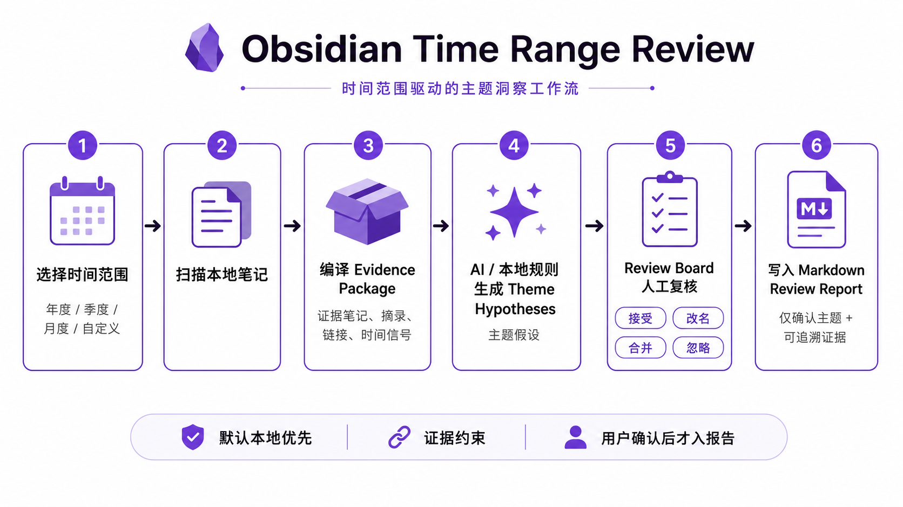

# Obsidian Time Range Review

[中文](README.md) | [Docs index](docs/README.md) | [SPEC](docs/product-specification.md)

Obsidian Time Range Review is an AI-assisted review plugin that helps users rediscover forgotten notes, uncover hidden themes across a selected time range, and generate evidence-backed Markdown review reports inside their vault.



It is a local-first, evidence-constrained Obsidian review plugin for annual,
quarterly, monthly, and custom ranges. It compiles source-note evidence packages,
uses AI to generate reviewable semantic theme hypotheses and connection
explanations, and turns user-confirmed themes into a traceable narrative
Markdown review report inside the vault.

It is built around four pains:

- **Forgetting**: after a busy period, you remember the recent, loud, or obvious
  notes, while older but important notes disappear.
- **Broken connections**: many real relationships between notes are never fully
  captured by links, tags, or folders.
- **Distrust of one-shot AI summaries**: AI can write polished summaries, but
  you need to know what it saw, why it connected those notes, and which claims
  still need review.
- **Review ranges beyond one year**: real reviews may be annual, quarterly,
  monthly, or custom ranges such as a launch, study period, leave, or recovery
  window.

The plugin's promise is not "one-click life summary." The core loop is:

```text
Choose time range -> Compile evidence notes -> Generate theme hypotheses -> User review -> Write confirmed Markdown report
```

Annual Review is only one preset; the same product definition covers Quarterly
Review, Monthly Review, and Custom Range. Every Theme Hypothesis must keep
Evidence Notes, connection explanations, and uncertainty notes. A hypothesis
enters the final report only after the user accepts, renames, merges, or
otherwise confirms it in Review Board.

## Who It Is For

- Obsidian users who write daily notes, work logs, reading notes, research
  notes, or evergreen notes.
- People who want to review a period without organizing their whole vault first.
- Users who want AI to extract themes and explain relationships, but do not want
  AI to make final judgments for them.
- Users who keep review artifacts as local Markdown and inspect changes with
  Obsidian Sync, Git, or another versioning tool.

## Core Concepts

| Concept          | Meaning                                                                                                           |
| ---------------- | ----------------------------------------------------------------------------------------------------------------- |
| Review Session   | One review's time range, scan scope, privacy settings, AI settings, state, and report path.                       |
| Evidence Note    | A source note included in the evidence pack, with path, title, excerpt, links, and time signals.                  |
| Evidence Cluster | A group of evidence notes that may support the same theme.                                                        |
| Theme Hypothesis | A proposed theme line based on evidence. It is a reviewable hypothesis, not a user conclusion.                    |
| Theme Decision   | The user's accept, rename, merge, or ignore decision for a theme hypothesis.                                      |
| Review Report    | The narrative Markdown report written to the vault, containing only confirmed themes and representative evidence. |

Project leads, task leads, action items, and archive judgments may return as
later extensions, but they are not MVP core objects or first-screen promises.

## Review Board Loop

`Annual Review: Open Review Board` opens the current Review Session's Theme
Hypothesis queue. Each theme card shows:

- Theme title and one-line explanation.
- Representative Evidence Notes.
- A Connection Explanation for why those notes may belong to the same line of
  thought.
- Evidence links, excerpts, and uncertainty notes.
- User actions: Accept, Rename, Merge, Ignore, Open Source Note.

Theme Hypotheses require user review. The plugin can say "these notes may form
this theme," but the final report turns user-confirmed themes into prose-led
review narrative with representative evidence, activity charts, reflection
questions, and user additions.

## Trusted Theme Review Safeguards

Review Board protects Theme Decisions; it is not just an AI-output preview. The
current loop reduces duplicate review and mistaken confirmation with a few
explicit rules:

- **Stable Review Candidate identity**: after a re-scan or provider change, a
  new Theme Hypothesis that cites substantially overlapping Evidence Notes keeps
  the prior accept, rename, merge, ignore, user note, and evidence-comment
  state. Low-overlap themes remain separate so different lines of thought are
  not accidentally merged.
- **Deduplicate instead of piling up themes**: when the provider produces
  several similar outputs over the same Evidence Notes, Review Board collapses
  them into one Review Candidate by default so users review fewer repeated
  cards.
- **Diverse Evidence Selection**: the provider-visible Evidence Package
  prioritizes coverage across time periods, folders, connection clusters, and
  long-tail clues instead of only the highest-scoring notes. Local fallback and
  provider generation share this bounded evidence contract.
- **Safe evidence references**: AI output should cite stable Evidence Note ids;
  path, wikilink, and title references are compatibility fallbacks. Duplicate
  titles, invalid references, and ambiguous references are not silently bound to
  arbitrary notes, and themes without traceable evidence do not enter Review
  Board.
- **Confirmed themes only**: the Review Report includes only user-confirmed
  accepted or renamed themes; candidates, ignored themes, and merged sources do
  not appear as independent report themes. Complete local signals and merge
  sources stay in Review Board or an explicit audit export.
- **Centralized Review Board rules**: queue visibility, allowed actions, next
  selection, merge-target rules, and report inclusion live in testable modules
  so future interaction changes do not drift.

These safeguards correspond to the recently completed trusted-review foundation:

| Completed capability       | User effect                                                                    |
| -------------------------- | ------------------------------------------------------------------------------ |
| Evidence-overlap identity  | Provider title, summary, or ordering changes do not re-open reviewed themes.   |
| Diverse evidence selection | Less obvious periods, folders, and connection clues can shape generation.      |
| Reference validation       | Duplicate titles and invalid evidence references do not pollute provenance.    |
| Review Board rules layer   | Review Board and Review Report share one answer for visible/reportable themes. |

Maintainer entry points:

- `src/core/reviewState.ts`: Theme Decision preservation, evidence-overlap
  matching, and report inclusion rules.
- `src/core/themeEvidence.ts`: Evidence Package construction, provider-visible
  selection, AI theme parsing, and evidence-reference validation.
- `src/obsidian/reviewSelection.ts` / `src/obsidian/reviewActions.ts`: Review
  Board queues, next selection, and action state.
- `tests/reviewState.spec.ts`, `tests/themeEvidence.spec.ts`,
  `tests/reviewBoard.spec.ts`, `tests/reviewActions.spec.ts`: regression tests.

## AI's Role

AI is the core analysis layer's **theme hypothesis generator and relationship
explainer**, not a final polishing feature:

- It generates semantic Theme Hypotheses only from a controlled Evidence
  Package.
- It explains subtle but traceable relationships between Evidence Notes.
- Its output must stay tied to source notes, excerpts, paths, and reviewable
  reasons.
- It marks uncertainty and notes that need careful user review.
- After the user confirms themes, it may help organize report text, but it
  cannot replace evidence review or user judgment.

Users explicitly choose an AI provider or local CLI path and confirm the time
range, excerpt count, excluded scope, and target boundary before anything is
sent. The plugin should avoid uncontrolled full-vault summarization: it first
compiles a bounded evidence package, then gives limited context to AI or local
rules to produce reviewable hypotheses. By default it makes no network
requests, calls no external provider, and sends no telemetry.

## Charts' Role

Charts remain in the Review Report as activity evidence. They help users
understand:

- activity rhythm;
- writing bursts;
- dormant periods;
- context for theme formation.

Charts support review and evidence interpretation, but they do not define the
product. The core loop remains evidence packages, AI theme hypotheses, user
review, and Markdown reports.

The default Review Report is not a Review Board audit export. It is structured
as a theme-first narrative: overview, activity rhythm charts, 3-5 strong themes
(fewer for sparse short ranges), worth-rereading notes, reflection questions, a
protected user-writing section, and a very short methodology note. Theme titles
are plain Markdown headings; evidence links in the body use readable aliases.
Complete evidence lists, local signals, hidden connection clusters, and merge
sources stay in Review Board or an explicit audit export.

## Plugin vs. Full Prompt

A strong prompt can ask a model to read many notes and summarize a period. The
plugin adds:

- Local scan and scope control: Annual / Quarterly / Monthly / Custom Range,
  include/exclude rules, and privacy boundaries.
- Reviewable evidence: every Theme Hypothesis is linked to source notes,
  excerpts, and connection explanations.
- Saved user decisions: accept, rename, merge, and ignore state persists in the
  Review Session.
- Reproducible output: reports contain confirmed content and regeneration does
  not overwrite user-written sections.
- Native Obsidian workflow: source notes open directly and the Markdown artifact
  remains in the vault.

## TODO: Prompt-vs-Plugin Benchmark

After the core product loop is complete, compare this plugin against a strong
prompt that asks an LLM to read the same vault and summarize the review themes.

The benchmark should compare:

- missed important notes;
- evidence accuracy;
- theme stability;
- user reviewability;
- Obsidian navigation;
- privacy and context control;
- regeneration consistency.

## Privacy And Edit Protection

- No network access, external AI calls, or telemetry by default.
- By default, the plugin reads only allowed Markdown files and Obsidian metadata
  cache inside the active vault.
- Report folders, templates, attachments, and user-excluded scopes are not
  scanned as source input.
- Generated text lives in plugin-managed sections, while user sections remain
  reserved for personal writing and edits.
- Regeneration only replaces reproducible sections and does not overwrite
  user-written sections.
- Every theme hypothesis and connection explanation keeps source-note evidence
  so the user can verify it before accepting it.

## Installation And Path Boundaries

Documentation uses three distinct vault paths:

- **Normal user vault**: the user's own Obsidian vault. Community installation
  and manual release-package installation target this path.
- **Repo-local validation vault**: `tests/fixtures/obsidian-smoke-vault`, used
  for unit-test samples and repository-local Review Board validation.
- **Custom smoke vault**: automation agents or release reviewers may set
  `SMOKE_VAULT_PATH` to an explicit local test vault; this is not a normal user
  installation path.

### Install From Obsidian Community Plugins

After the plugin is listed:

1. Open Obsidian `Settings -> Community plugins`.
2. Search for **Annual Review**.
3. Click **Install**, then **Enable**.

### Manual Release Package Install

```bash
npm install
npm run release:plugin
```

Copy the release artifacts to a vault plugin directory:

```bash
VAULT="/path/to/YourVault"
PLUGIN_DIR="$VAULT/.obsidian/plugins/annual-review"
mkdir -p "$PLUGIN_DIR"
cp dist/annual-review/{manifest.json,main.js,styles.css} "$PLUGIN_DIR/"
```

Open Obsidian and enable **Annual Review** from `Settings -> Community plugins`.

## Available Commands

| Command                            | Purpose                                                                                           |
| ---------------------------------- | ------------------------------------------------------------------------------------------------- |
| `Annual Review: Rebuild index`     | Rescan allowed Markdown notes for the current Review Session and record a snapshot.               |
| `Annual Review: Open Review Board` | Open the Theme Hypothesis queue for evidence review, connection explanation, and theme decisions. |
| `Annual Review: Generate report`   | Write a protected Markdown review report for Annual / Quarterly / Monthly / Custom Range.         |

## Development Commands

| Command             | Purpose                                                    |
| ------------------- | ---------------------------------------------------------- |
| `npm run test`      | Run Vitest.                                                |
| `npm run typecheck` | Run TypeScript type checking without emitting build files. |
| `npm run build`     | Build the installable Obsidian plugin bundle.              |
| `npm run lint`      | Run ESLint.                                                |
| `npm run format`    | Format code and docs with Prettier.                        |

## Local Validation

```bash
npm install
npm run test
npm run typecheck
npm run build
npm run lint
```

Repo-local smoke validation uses `tests/fixtures/obsidian-smoke-vault`; do not
point this flow at a personal vault:

```bash
npm run dev:deploy-smoke
/Applications/Obsidian.app/Contents/MacOS/obsidian-cli vault="obsidian-smoke-vault" plugin:reload id=annual-review
/Applications/Obsidian.app/Contents/MacOS/obsidian-cli vault="obsidian-smoke-vault" command id=annual-review:rebuild-annual-review-index
/Applications/Obsidian.app/Contents/MacOS/obsidian-cli vault="obsidian-smoke-vault" command id=annual-review:open-annual-review-dashboard
```

Manual smoke checks:

1. Install and enable the plugin.
2. Create an Annual, Quarterly, Monthly, or Custom Range Review Session.
3. Run `Annual Review: Rebuild index`.
4. Open Review Board and confirm Theme Hypotheses, Evidence Notes, Connection
   Explanation, and review actions are visible.
5. Accept, rename, merge, or ignore several Theme Hypotheses.
6. Run `Annual Review: Generate report`.
7. Confirm the report presents user-confirmed themes as prose-led narrative,
   keeps activity charts, aliased representative evidence links, a very short
   methodology note, and user-written sections, and that source notes can be
   opened.
